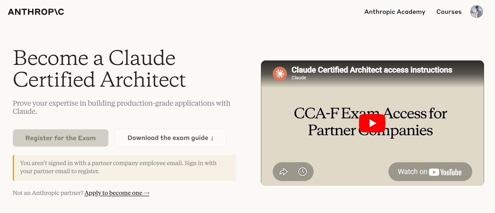

# Claude Certified Architect – Foundations

This repository contains study materials for the **Claude Certified Architect — Foundations** certification.



> **Based on official information from Anthropic's Claude Certified Architect – Foundations Certification Exam Guide.**

The **Claude Certified Architect – Foundations** certification validates that practitioners can make informed decisions about tradeoffs when implementing real-world solutions with Claude. This repository contains hands-on exercises and code examples aligned with the certification domains.

---

## Exam Overview

| Detail | Info |
|---|---|
| **Format** | Multiple choice (1 correct, 3 distractors) |
| **Scoring** | Scaled score of 100–1,000 |
| **Passing Score** | 720 |
| **Scenarios** | 4 out of 6 scenarios selected at random |
| **Penalty for Guessing** | None |

---

## Content Domains & Weightings

| Domain | Weight |
|---|---|
| **Domain 1:** Agentic Architecture & Orchestration | 27% |
| **Domain 2:** Tool Design & MCP Integration | 18% |
| **Domain 3:** Claude Code Configuration & Workflows | 20% |
| **Domain 4:** Prompt Engineering & Structured Output | 20% |
| **Domain 5:** Context Management & Reliability | 15% |

---

## Exam Scenarios

The exam uses scenario-based questions grounded in realistic production contexts. During the exam, **4 scenarios are randomly selected** from the following 6:

### Scenario 1: Customer Support Resolution Agent

Build a customer support agent using the Claude Agent SDK that handles high-ambiguity requests (returns, billing disputes, account issues). The agent integrates with backend systems through custom MCP tools (`get_customer`, `lookup_order`, `process_refund`, `escalate_to_human`) and targets 80%+ first-contact resolution while knowing when to escalate.

**Primary Domains:** Agentic Architecture & Orchestration, Tool Design & MCP Integration, Context Management & Reliability

### Scenario 2: Code Generation with Claude Code

Use Claude Code to accelerate software development — code generation, refactoring, debugging, and documentation. Integrate it into team workflows with custom slash commands, `CLAUDE.md` configurations, and understand when to use plan mode vs. direct execution.

**Primary Domains:** Claude Code Configuration & Workflows, Context Management & Reliability

### Scenario 3: Multi-Agent Research System

Build a multi-agent research system using the Claude Agent SDK. A coordinator agent delegates to specialized subagents: web search, document analysis, findings synthesis, and report generation. The system produces comprehensive, cited reports.

**Primary Domains:** Agentic Architecture & Orchestration, Tool Design & MCP Integration, Context Management & Reliability

### Scenario 4: Developer Productivity with Claude

Build developer productivity tools using the Claude Agent SDK. The agent helps engineers explore unfamiliar codebases, understand legacy systems, generate boilerplate, and automate repetitive tasks using built-in tools (Read, Write, Bash, Grep, Glob) and MCP server integrations.

**Primary Domains:** Tool Design & MCP Integration, Claude Code Configuration & Workflows, Agentic Architecture & Orchestration

### Scenario 5: Claude Code for Continuous Integration

Integrate Claude Code into CI/CD pipelines for automated code reviews, test generation, and pull request feedback. Design prompts that provide actionable feedback and minimize false positives.

**Primary Domains:** Claude Code Configuration & Workflows, Prompt Engineering & Structured Output

### Scenario 6: Structured Data Extraction

Build a structured data extraction system that extracts information from unstructured documents, validates output using JSON schemas, handles edge cases gracefully, and integrates with downstream systems.

**Primary Domains:** Prompt Engineering & Structured Output, Context Management & Reliability

---

## Target Candidate Profile

The ideal candidate is a solution architect with **6+ months** of hands-on experience building production applications with Claude, including:

- **Agentic Applications** — Multi-agent orchestration, subagent delegation, tool integration, and lifecycle hooks using the Claude Agent SDK
- **Claude Code Customization** — `CLAUDE.md` files, Agent Skills, MCP server integrations, and plan mode
- **MCP Design** — Model Context Protocol tool and resource interfaces for backend system integration
- **Prompt Engineering** — Reliable structured output using JSON schemas, few-shot examples, and extraction patterns
- **Context Window Management** — Long documents, multi-turn conversations, and multi-agent handoffs
- **CI/CD Integration** — Automated code review, test generation, and pull request feedback
- **Reliability & Escalation** — Error handling, human-in-the-loop workflows, and self-evaluation patterns

---

## Core Technologies Covered

| Technology | Description |
|---|---|
| **Claude API** | Direct API interaction — requests, multi-turn conversations, system prompts, streaming, structured output |
| **Claude Agent SDK** | Building agentic applications with multi-agent orchestration and tool use |
| **Claude Code** | AI-powered development tool with custom commands, configurations, and CI/CD integration |
| **Model Context Protocol (MCP)** | Standardized protocol for connecting Claude to external tools and data sources |

---

## Repository Structure

```
claude-certified-architect-courses/
├── accessing-claude-with-the-api/
│   ├── 001_requests/              # Basic API requests
│   ├── 002_multi_turn_conversations/ # Conversation management
│   ├── 003_chat_exercise/         # Chat implementation exercise
│   ├── 004_system_prompts/        # System prompt configuration
│   ├── 005_system_prompts_exercise/ # System prompt exercise
│   ├── 006_temperature/           # Temperature parameter tuning
│   ├── 007_streaming/             # Streaming responses
│   └── 008_structured_data/       # Structured data extraction
```

---

## Getting Started

```bash
# Clone the repository
git clone <repo-url>
cd claude-certified-architect-courses

# Create and activate virtual environment
python -m venv .venv
# Windows
.venv\Scripts\Activate.ps1
# macOS/Linux
source .venv/bin/activate

# Install dependencies for a specific module
cd accessing-claude-with-the-api/001_requests
pip install -r requirements.txt
```

> **Note:** Each module has its own `requirements.txt`. Install dependencies per module as needed.

---

## Disclaimer

This repository is a personal learning resource. The exam guide content referenced above is based on official information published by [Anthropic](https://www.anthropic.com). All trademarks belong to their respective owners.
